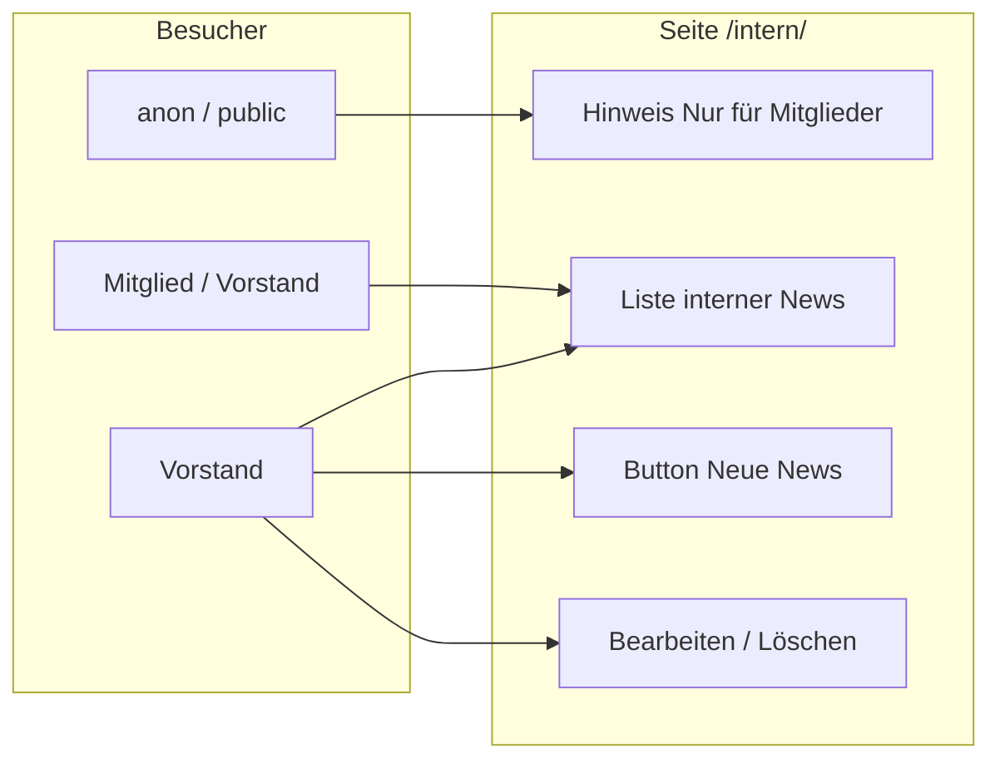

# Konzept: Internes Schwarzes Brett (Mitglieder-News)

**Status:** Implementiert  
**Stand:** Juni 2026

---

## Ziel

Eine **interne** Seite für Vereinsmitglieder: News, Informationen, Hinweise („Bleib auf dem Laufenden“). Vorstand pflegt Inhalte wie ein **Schwarzes Brett**. Aufbau und Bedienung **analog Kalender** (`/kalender/`), aber:

- Mindest-Rolle: **Mitglied** (bzw. Vorstand)
- `public` / nicht eingeloggt: Hinweis **„Nur für Mitglieder“**
- **Keine** Abstimmung / Auswertung auf der Liste (im Gegensatz zu Termin-Karten mit Zusagen)
- Sortierung: **neueste zuerst**, gruppiert nach **Jahr** und **Monat** (wie Kalender-Liste)

---

## Namensvorschlag (UI)

| Element | Vorschlag |
|---------|-----------|
| Navigation | **Internes** |
| Seitentitel | **Internes — News & Infos** |
| URL | `/intern/` |
| Login-Hinweis (Gäste) | „Dieser Bereich ist nur für Vereinsmitglieder.“ |

Alternativen: „Schwarzes Brett“, „Mitglieder-Infos“, „Bleib informiert“.

---

## Ist-Zustand (Repo)

| Thema | Stand |
|--------|--------|
| Tabelle `News` in Supabase | vorhanden (`sichtbarkeit`: `public` \| `members` \| `draft`) |
| RLS | `members`-News nur für eingeloggte Mitglieder; Schreiben nur **Vorstand** |
| Öffentliche News-Seite `/news/` | **nicht** im Repo (entfernt / nie nachgezogen) |
| Seite `/intern/` | `intern.md` + `assets/js/intern/` |
| Kalender-Liste | `kalender.md` + `event-cards.js` — Jahr/Monat-Trenner, Vorstand-Buttons |
| `canAccessNewsSection()` | `true` für Vereinsmitglieder (Internes-Liste) |

**Empfehlung:** Bestehende Tabelle **`News` wiederverwenden**, nicht neue Tabelle — weniger SQL, RLS passt bereits.

---

## Sichtbarkeit & Zielgruppen

| Zustand | Was sieht man |
|---------|----------------|
| Nicht eingeloggt / Rolle `public` | Statischer Hinweis + Link zum Mitglieder-Login (keine Inhalte) |
| `Mitglied` oder `Vorstand` | Alle News mit `sichtbarkeit = members` (und für Vorstand zusätzlich `draft` als Entwurf-Kennzeichnung) |
| `Vorstand` | Wie Mitglied + **Neue News**, pro Karte **Bearbeiten** / **Löschen** |

**Filter auf dieser Seite:** nur `sichtbarkeit IN ('members', 'draft')` — **keine** öffentlichen News (`public`). Öffentliche Inhalte bleiben ggf. später woanders (Startseite, separates `/news/`).

---

## Seitenaufbau (wie Kalender)

### Listenansicht `/intern/`

- Container `#intern-news-cards` (Analogie: `#event-cards`)
- Optional oben: Button **„Neue News“** (nur Vorstand) → Editor (Popup oder `/intern-bearbeiten/`)
- Kartenliste:
  - Sortierung: `created_at` **absteigend** (neueste oben)
  - Gruppierung: **Jahres-Trenner** + **Monats-Trenner** (CSS-Klassen wie `kalender-year-divider` / `kalender-month-divider` wiederverwenden oder spiegeln)
- Pro Karte (Vorschlag):
  - Datum
  - Titel
  - Kurztext / Teaser (erste Zeilen)
  - Optional Bild-Thumbnail
  - Badge „Entwurf“ nur für Vorstand bei `draft`
  - **Kein** Feedback-Block, **keine** Teilnehmer-Auswertung
- Vorstand pro Karte: **Bearbeiten** | **Löschen** (wie Kalender-Vorstand-Aktionen)

### Detailansicht

- Klick auf Karte → `/intern-detail.html?slug=…` (analog Termin-Detail)
- Volltext + optionales Bild
- **Kein** Feedback / keine Umfrage (Poll ggf. später)

### Editor (Vorstand)

- Analog `/termin-bearbeiten/`: `/intern-bearbeiten/?id=…`
- Felder wie Termin-Editor: Titel, Text, **optionales** Bild
- `sichtbarkeit` fest **`members`** (oder Entwurf `draft` bis Veröffentlichen)
- Kein Sichtbarkeits-Dropdown auf dieser Seite

---

## Technische Umsetzung (Grobraster)

### Frontend (neu)

| Datei / Bereich | Aufgabe |
|-----------------|--------|
| `intern.md` | Jekyll-Seite, lädt CSS/JS |
| `assets/js/intern/` | `news-loader.js`, `intern-cards.js`, `intern-page.js` |
| `intern-bearbeiten.md` | Vorstand-Editor (oder Wiederverwendung generischem Content-Editor) |
| `intern-detail.html` | Detailseite |
| `_data/navigation.yml` | Eintrag „Internes“ |
| `assets/css/calendar.css` oder `intern.css` | Listen-Layout (viel von Kalender übernehmen) |

### Wiederverwendung vom Kalender

- `ensureContentViewerMember()` / `resolveContentListingViewer()`
- Jahr/Monat-Divider-Logik aus `event-cards.js` (extrahieren oder spiegeln)
- Vorstand-Button-Muster: `renderKalenderNewTerminButton` → `renderInternNewNewsButton`
- `canShowEventVorstandTools` → gleiche Funktion oder `isVorstand(viewer)`

### Daten

- `fetchNews()` mit Cache (wie `fetchTermine()`)
- Client-Filter: `sichtbarkeit === 'members'` (+ `draft` für Vorstand)
- Sort: `created_at DESC`

### SQL

- **Keine neue Tabelle** — `News` mit `created_at` (Migration in `supabase-member-change-summary.sql`)
- **Tröte:** `get_member_change_summary()` zählt heute noch `News` mit — bei Umsetzung **News aus Tröte entfernen** (nur Termine, Aktivitäten, Abstimmungen o. Ä.)
- **Löschen:** Hartes `DELETE` auf `News`; Kaskade über bestehenden Trigger `supabase-feedback-cascade-delete.sql` (falls Feedback-Modul existiert)

### Auth / Magic Link

- Redirect URLs: `/intern/**` in Supabase Auth ergänzen

---

## Abgrenzung Kalender vs. Internes

| | Kalender (`/kalender/`) | Internes (`/intern/`) |
|--|-------------------------|------------------------|
| Daten | `Termine` | `News` |
| Sortierung | kommende Termine (aufsteigend) | News (absteigend) |
| Sichtbarkeit | public + members (+ draft) | **nur members** (+ draft für Vorstand) |
| Feedback / Zusagen | ja | **nein** |
| Vorstand: neu / bearbeiten / löschen | ja | ja |
| Gäste | sehen öffentliche Termine | **nur Hinweis** |

---

## Aufwand (grobe Schätzung)

| Block | Aufwand |
|-------|---------|
| Listen-Seite + Karten + Divider | mittel (Kalender als Vorlage) |
| Gast-Hinweis + Login-Flow | gering |
| Detailseite | mittel |
| Editor + Löschen | mittel–hoch (News-Editor fehlt im Repo, ggf. neu) |
| Navigation, Doku, Redirect URLs | gering |
| Tests manuell | gering |

---

## Getroffene Entscheidungen

| Thema | Entscheidung |
|--------|----------------|
| Name & URL | **„Internes“**, `/intern/` |
| Datenmodell | Bestehende Tabelle **`News`**, auf der Seite nur `members` (+ `draft` für Vorstand) |
| Detail | **Eigene Detailseite** (wie Termin-Detail) |
| Monat/Jahr | **Nur Gruppierung** mit Trennlinien, kein Monats-Umschalter |
| Navigation | **Für alle sichtbar** — Gäste: Hinweis „Nur für Mitglieder“ |
| **Tröte** | **Kein Bezug zu News** — interne News lösen keine Tröte aus; SQL anpassen |
| **Feedback / Poll** | **Nein** (weder Liste noch Detail); Poll später möglich |
| **Editor** | Wie **Termin-Editor** (`/termin-bearbeiten/`) |
| **Sortierung** | Nach **`created_at`** (Erstellungsdatum, absteigend) |
| **Bild** | **Optional** |
| **Löschen** | **Hart löschen** (`DELETE`), inkl. Kaskade Feedback-Modul falls vorhanden |

---

## Implementierungs-Checkliste (wenn freigegeben)

1. `intern.md`, `intern-detail.html`, `intern-bearbeiten.md`
2. JS: `fetchNews`, Karten, Divider, Vorstand-Aktionen (Vorlage Kalender)
3. Navigation + Redirect URLs `/intern/**`
4. SQL: `get_member_change_summary()` — Zähler `news` entfernen
5. Kein `feedback-init` auf Internes-Seiten
6. Manuell: Gast / Mitglied / Vorstand / Entwurf / Löschen

---

## Siehe auch

- [ARCHITECTURE.md](ARCHITECTURE.md) — Content-Muster Termin/News
- [supabase/SCHEMA.md](supabase/SCHEMA.md) — Tabelle `News`
- [supabase/RUNBOOK.md](supabase/RUNBOOK.md)
