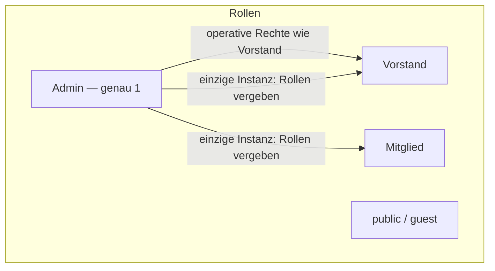

# Konzept: Rolle Admin (spätere Umsetzung)

**Status:** Geplant — **nicht implementiert**  
**Stand:** Juni 2026  
**Zweck:** Sicherheits- und Rollenmodell für eine einmalige Admin-Rolle, bevor Code/SQL angepasst werden.

---

## Ausgangslage (heute)

| Thema | Ist-Zustand |
|--------|-------------|
| Rollen in `members.rolle` | `Mitglied`, `Vorstand`, `public`, `guest` |
| Operative Rechte | `is_vorstand()` in RLS und Frontend |
| Rollen vergeben | Vorstand in `/mitglied-bearbeiten/` (Feld `rolle`) |
| Account löschen | `public` selbst; Vorstand kann Mitglieder anonymisieren |
| Schutz der eigenen Rolle | Kein DB-Schutz gegen direkte API-Updates auf `rolle` |

---

## Zielbild

- **Genau ein Admin** — immer vorhanden, an einen festen Mitglieder-Account gebunden (initial: Vereins-Admin / Projektverantwortlicher).
- **Admin kann alles**, was Vorstand heute kann, **plus** alleinige Rollenvergabe.
- **Vorstand** behält operative Verwaltung (Termine, Protokolle, E-Mail, Mitgliederdaten …), **verliert** aber die Möglichkeit, `rolle` zu ändern.
- **Niemand** (auch kein Vorstand) kann dem Admin Rechte entziehen oder den Admin-Account löschen/anonymisieren — über die Website.

| Rolle | Verwaltung (Termine, Mitglieder, …) | Rollen vergeben |
|--------|-------------------------------------|-----------------|
| Admin | Ja | **Ja — nur Admin** |
| Vorstand | Ja | **Nein** |
| Mitglied | Nur eigenes Profil | Nein |
| public / guest | Nein | Nein |

---

## Kernprinzip: Doppelte Verankerung

Nur `rolle = 'Admin'` in der Tabelle reicht nicht (Dashboard, direkte API). Zusätzlich ein **Singleton**:

| Konfiguration | Bedeutung |
|---------------|-----------|
| `primary_admin_member_id` | Die eine `members.id` des Admins |
| `primary_admin_email` | Dokumentation / Plausibilitätsprüfung (normalisiert) |
| `bound_at` | Zeitpunkt der Erstbindung |

Speicherort (Vorschlag): `site_state`-Key oder eigene Tabelle `system_roles`.

**Admin ist nur**, wer gleichzeitig:

1. `members.id = primary_admin_member_id`
2. `anonymized_at IS NULL`
3. eingeloggte E-Mail = E-Mail dieser Zeile (Magic Link)

---

## Hilfsfunktionen (konzeptionell)

| Funktion | Verhalten |
|----------|-----------|
| `is_admin()` | true nur für kanonischen Admin (Singleton + Session) |
| `is_vorstand()` | true für `rolle = Vorstand` **oder** `is_admin()` |
| `is_club_member()` | wie heute, inkl. Admin |

So bleiben die meisten bestehenden RLS-Policies nutzbar: Admin erbt Vorstands-Rechte, **außer** bei Rollenvergabe.

---

## Rollenvergabe — nur Admin

### Einziger Schreibweg für `members.rolle`

Direkte `UPDATE` auf `rolle` (Vorstand-RLS, eigenes Profil) abschalten. Stattdessen eine RPC, z. B. `admin_set_member_role(target_member_id, new_role)`:

| Prüfung | Verhalten |
|---------|-----------|
| Aufrufer `is_admin()` | sonst Fehler |
| Ziel = `primary_admin_member_id` | Rolle **nicht änderbar** |
| Aufrufer = Ziel | **keine Selbst-Degradation** |
| `new_role` | nur `Mitglied`, `Vorstand` (kein zweiter Admin über UI) |
| `public` / `guest` | weiter über bestehende Public-/Event-Flows |

### Trigger (Defense in depth)

- **BEFORE UPDATE** auf `members`: Änderung von `rolle` ohne Admin-RPC → Fehler
- **BEFORE UPDATE/DELETE**: Aktionen gegen `primary_admin_member_id`, die Admin entfernen würden → Fehler

---

## Admin nicht löschbar

| Aktion | Regel |
|--------|--------|
| Self-Service Löschen (Profil) | für Admin gesperrt |
| Anonymisierung durch Vorstand/Admin | gesperrt, wenn Ziel = Admin |
| Edge Function `anonymize-member-account` | gleiche Prüfung |
| `DELETE` auf Admin-Zeile | verboten |

---

## Erstbindung (Go-live der Funktion)

1. Mitglied mit Admin-E-Mail existiert in `members`.
2. Migration setzt `primary_admin_member_id` und `rolle = 'Admin'` auf dieser Zeile.
3. RUNBOOK-Eintrag: einmalig per SQL, nicht über Website änderbar.

**Kein Admin-Transfer in der Website** (empfohlen). Optionaler Wechsel nur per dokumentiertem Break-Glass (SQL + Zwei-Personen-Review).

---

## UI (bei Umsetzung)

| Bereich | Admin | Vorstand |
|---------|-------|----------|
| `/mitglied-bearbeiten/` | Rolle editierbar | Rolle nur Anzeige |
| Neues Mitglied | Rolle setzbar | nur `Mitglied`, Rolle fix |
| Eigenes Profil löschen | ausgeblendet + DB blockiert | wie heute |

Optional: eigener Bereich **Rollen** nur im Admin-Profil.

---

## Bekannte Grenzen

| Risiko | Mitigation |
|--------|------------|
| Supabase Dashboard (service_role) umgeht RLS | Nur vertrauenswürdige Personen, 2FA, kein geteiltes Login |
| Falsche E-Mail in Erst-Migration | Checkliste + Test-Login vor Live |
| Admin verliert E-Mail-Zugang | Recovery über Supabase Auth + SQL (Break-Glass) |

Schutz gilt gegen **alle Website-Nutzer inkl. Vorstand**, nicht gegen einen böswilligen Supabase-Projekt-Owner.

---

## Umsetzungsreihenfolge (wenn freigegeben)

1. Singleton + `is_admin()` + Trigger + RPC `admin_set_member_role`
2. `is_vorstand()` erweitern (Admin erbt operative Rechte)
3. Vorstand-RLS: `rolle` nicht mehr direkt schreibbar
4. Frontend: Rollenfeld nur für Admin; Aufruf nur via RPC
5. `anonymize_member` + Edge Function: Admin geschützt
6. Regression: Vorstand ohne Rollenänderung; Admin mit Rollenänderung; Admin nicht löschbar

Betroffene Bereiche (Orientierung): `docs/supabase/supabase-vorstand-roles.sql`, `supabase-members-admin.sql`, `supabase-members-anonymize.sql`, `assets/js/admin/members-edit.js`, `mitglied-bearbeiten.md`, Edge Function `anonymize-member-account`.

---

## Entscheidungen (vor Implementierung klären)

| Frage | Empfehlung |
|-------|------------|
| Admin zusätzlich oder statt Vorstand auf einem Account? | `rolle = Admin`, `is_vorstand()` inkludiert Admin |
| Mehrere Vorstände? | Ja, unverändert |
| Admin-Transfer? | Nur Break-Glass per SQL, nicht im Alltag |

---

## Siehe auch

- [supabase/RUNBOOK.md](supabase/RUNBOOK.md) — aktuelle SQL-Reihenfolge
- [ARCHITECTURE.md](ARCHITECTURE.md) — Rollen und Verwaltung im Frontend
- [supabase/SCHEMA.md](supabase/SCHEMA.md) — Spalte `members.rolle`
