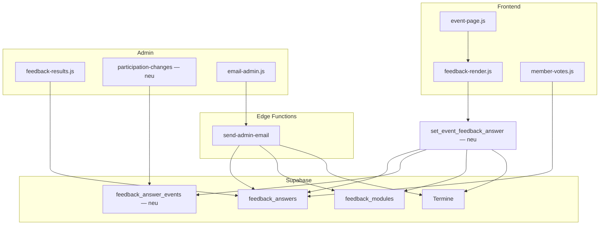

# Phase 4 — Technische Umsetzungsplanung

**Status:** 📋 **Technische Planung** — noch **nicht** zur Implementierung freigegeben  
**Bezug (fachlich freigegeben):** `docs/PHASE-4-ZUSAGEN-SERIENTERMINE-KONZEPT.md`  
**Stand:** Juni 2026  
**Scope dieses Dokuments:** Architektur, Datenmodell, Migration, betroffene Dateien, Risiken, Aufwand — **keine** Implementierung, **keine** SQL-Dateien, **keine** Code- oder DB-Änderungen.

> Alle **Produktentscheidungen** aus dem Fachkonzept gelten als abgeschlossen. Dieses Dokument trifft ausschließlich **technische** Festlegungen und Empfehlungen zur Umsetzung.

---

## 0. Ausgangslage (Ist-Technik)

### 0.1 Datenmodell

| Tabelle | Relevante Eigenschaften |
|---------|-------------------------|
| `feedback_modules` | Ein Modul pro Termin/News (`UNIQUE entity_type, entity_id`); Typ `yes_maybe` für Termine; `config jsonb`; `public_voting`, `enabled` |
| `feedback_answers` | `answer`: `yes` \| `maybe` (Termine); `UNIQUE (module_id, member_id)`; `comment` optional; Upsert clientseitig |
| `Termine` | `recurring boolean`; Serien vs. Einzeltermin nur in `Termine`, **nicht** in `feedback_modules` gespiegelt |

Es gibt **keine** Historie-Tabelle, **keine** Absagegründe, **kein** serverseitiges Enforcement der Ja-Verbindlichkeit.

### 0.2 Antwort-Pfad heute

```
Frontend (feedback-render.js)
  → saveFeedbackAnswer() / deleteFeedbackAnswer()  [feedback-service.js]
  → Supabase REST Upsert/Delete auf feedback_answers (RLS: own row)
Public-Gast
  → submit_public_feedback() RPC  [supabase-feedback-enabled.sql]
```

**Problem:** Ja → stilles Löschen per erneutem Klick auf aktiven Button (`withdrawAnswer()` in `feedback-render.js`) — ohne Server-Validierung.

### 0.3 Admin & E-Mail

| Komponente | Ist-Verhalten |
|------------|---------------|
| `admin/feedback_results.html` | Zählt `yes` + `maybe` gemeinsam; keine Trennung „verbindlich / Interessenten“ |
| `admin/js/feedback-list.js` | Summary-Zeilen für Ja + Vielleicht |
| `send-admin-email` Modus `event` | Empfänger: alle `yes` **und** `maybe` (`isRegisteredEventAnswer`) |
| Backoffice „Teilnahmeänderungen“ | **existiert nicht** |

### 0.4 Anonymisierung

`anonymize_member()` nullt heute `feedback_answers.comment`, löscht Antworten **nicht**, schreibt **keine** Events.

---

## 1. Technische Architektur (Zielbild)

Phase 4 wird **getrennt** umgesetzt — analog zum Fachkonzept:

| Phase | Fachlicher Kern | Technischer Kern |
|-------|-----------------|------------------|
| **4a** | Verbindlichkeit Einzeltermine | Server-RPC + Historie + Absagegründe + Backoffice-Feed |
| **4b** | Serien = Informationskanal | UI-Modus + `answer = informed` + Admin-Auswertung/E-Mail angepasst |
| **4c** | Sonderfall datumsbezogen | Nur dokumentiert (§6); **keine** Umsetzungsempfehlung |

### 1.1 Leitprinzipien

1. **Feedback-System beibehalten** — keine separate RSVP-Tabelle (IA-konform).
2. **Verbindlichkeitslogik serverseitig** — Client-Dialog allein reicht nicht (RLS-Umgehung, Public-RPC).
3. **Historie append-only** — Zustandsänderungen in eigener Tabelle, nicht nur `updated_at`.
4. **Modus über `feedback_modules.config`** — Unterscheidung Einzeltermin / Serie / (später) 4c ohne Schema-Split.
5. **Deploy-Reihenfolge:** DB → Edge Function → Frontend/Admin → Migrationsskripte (manuell im SQL Editor).

### 1.2 Architekturdiagramm (Ziel)



---

## 2. Technische Festlegungen (aus §9 Fachkonzept aufgelöst)

Diese Punkte waren im Fachkonzept noch offen; hier **technische** Empfehlung **ohne** neue Produktentscheidung:

| Thema | Empfehlung | Begründung |
|-------|------------|------------|
| Historie-Modell | Neue Tabelle `feedback_answer_events` | Append-only; Löschen der Antwort erfasst trotzdem Historie; keine Überladung von `feedback_answers` |
| Absagegrund speichern | Spalte `cancellation_reason_code` **in Events**; optionaler Freitext in `comment` (Events) | Grund gehört zur Änderung, nicht zum Endzustand; Wiederverwendung bestehendes `comment`-Muster |
| Serien-`answer`-Wert | Neuer Code **`informed`** | Eindeutig von `yes`/`maybe` trennbar; Admin-Labels und E-Mail-Filter ohne Semantik-Leak |
| Modus-Steuerung | `feedback_modules.config.event_mode`: `rsvp` \| `subscription` \| `per_occurrence` | `rsvp` = Einzeltermin 4a; `subscription` = Serie 4b; `per_occurrence` = reserviert für 4c |
| Antwort-Pfad Termine | RPC **`set_event_feedback_answer`** ersetzt direktes Upsert/Delete für Event-Module | Enforcement Absage-Hürde; einheitlich für Mitglied + Public |
| Backoffice-Platzierung | Neue Admin-Seite **`admin/participation_changes.html`** + Nav-Eintrag unter Feedback | Chronologischer Feed; getrennt von statischer Teilnehmerliste |
| Public im Backoffice | `members.rolle` in Feed anzeigen (Pattern wie `formatFeedbackMemberName` in `feedback-results.js`) | Bereits etabliert: „(extern)“ |
| Anonymisierung | `anonymize_member()` erweitern: Events `comment = null`; `cancellation_reason_code` optional auf Platzhalter oder NULL | Fachlich: Historie bleibt; personenbezogener Freitext entfällt |
| `send-admin-email` | Modus `event`: Empfänger anhand `config.event_mode` filtern | `subscription` → nur `informed`; `rsvp` → `yes` + `maybe` (Info-Kanal laut Fachkonzept) |
| E-Mail-Digest | **Nicht** in v1 | Fachkonzept: optional später |

### 2.1 Absagegründe (technische Codes)

Mapping feste Produktliste → DB-Code (CHECK-Constraint):

| Anzeige (UI) | `cancellation_reason_code` |
|--------------|----------------------------|
| Krankheit | `krankheit` |
| Familie | `familie` |
| Arbeit | `arbeit` |
| Wetter | `wetter` |
| Terminüberschneidung | `terminueberschneidung` |
| Sonstiges | `sonstiges` |

Freitext nur bei `sonstiges` → Feld `comment` im **Event**-Datensatz (optional, max. Länge wie heute 500 Zeichen).

---

## 3. Phase 4a — Einzeltermine (technisch)

### 3.1 Fachliche Regeln → technische Transitionen

Gilt für Module mit `type = yes_maybe` und `config.event_mode = rsvp` (Default für `Termine.recurring = false`).

| Von | Nach | Hürde | Historie-Event |
|-----|------|-------|----------------|
| — | `yes` | UI: Bestätigung Verbindlichkeit (optional bei erstem Ja) | `set_answer` |
| — | `maybe` | nein | `set_answer` |
| `maybe` | — (Delete) | nein | `withdraw` |
| `maybe` | `yes` | UI: Bestätigung Verbindlichkeit | `set_answer` |
| `yes` | — (Delete) | **Absagegrund Pflicht** | `withdraw_after_yes` |
| `yes` | `maybe` | **Absagegrund Pflicht** | `downgrade_after_yes` |
| `yes` | `yes` | — | kein Event |

**Public:** identische RPC-Logik über `submit_public_feedback` → intern `set_event_feedback_answer` aufrufen oder Logik zusammenführen.

### 3.2 Datenbankänderungen (geplant, noch nicht anlegen)

#### 3.2.1 Tabelle `feedback_answer_events` (neu)

| Spalte | Typ | Hinweis |
|--------|-----|---------|
| `id` | bigint PK | |
| `module_id` | bigint FK → `feedback_modules` | denormalisiert für Abfragen |
| `member_id` | bigint FK → `members` | |
| `answer_id` | bigint FK → `feedback_answers` NULL | NULL wenn Antwort gelöscht |
| `event_type` | text | `set_answer` \| `withdraw` \| `withdraw_after_yes` \| `downgrade_after_yes` |
| `from_answer` | text NULL | vorheriger Code |
| `to_answer` | text NULL | neuer Code; NULL bei Withdraw |
| `cancellation_reason_code` | text NULL | CHECK gegen Enum §2.1 |
| `comment` | text NULL | optional Freitext bei `sonstiges` |
| `created_at` | timestamptz | |

**Indizes:** `(module_id, created_at DESC)`, `(member_id, created_at DESC)`, `(created_at DESC)` für Backoffice-Feed.

**RLS:** SELECT nur `is_vorstand()`; INSERT nur via SECURITY DEFINER RPC (kein direkter Client-Insert).

#### 3.2.2 `feedback_modules.config` (Erweiterung, kein DDL nötig)

```json
{
  "event_mode": "rsvp"
}
```

Bei Serien (4b): `"event_mode": "subscription"`. Optional später: `"per_occurrence"`.

Admin setzt `event_mode` beim Speichern automatisch aus `Termine.recurring` (`termine-edit.js` / `saveFeedbackAdminForEntity`).

#### 3.2.3 `feedback_answers` (minimal)

Keine Pflicht-Neu-Spalten für 4a. Optional:

- `committed_at timestamptz` — Zeitpunkt des letzten Wechsels auf `yes` (vereinfacht Backoffice-Anzeige; **alternativ** aus Events ableitbar → **Empfehlung:** weglassen, nur Events).

**CHECK-Constraint `answer`:** erweitern um `informed` (4b-Vorbereitung in gleicher Migration).

#### 3.2.4 RLS-Anpassung

| Policy | Änderung |
|--------|----------|
| `feedback_answers_insert_own` / `update_own` / `delete_own` | Für Event-Module mit `yes_maybe`: **entfernen oder einschränken** — Schreiben nur noch über RPC |
| Poll / News | unverändert direktes Upsert |

Technische Variante (empfohlen): RPC `set_event_feedback_answer` als einziger Schreibweg; Policies für INSERT/UPDATE/DELETE auf `feedback_answers` prüfen per Subquery, ob Modul **kein** Event-`yes_maybe` ist.

### 3.3 RPCs (geplant)

#### `set_event_feedback_answer`

```text
Parameter:
  p_module_id bigint
  p_answer text          -- 'yes' | 'maybe' | NULL (= zurückziehen)
  p_comment text         -- optional; nur bei cancellation sonstiges
  p_cancellation_reason_code text  -- Pflicht bei yes → maybe/NULL

Rückgabe: jsonb { ok, answer_row?, event_id? }
```

**Ablauf (vereinfacht):**

1. Modul laden; prüfen `enabled`, `type = yes_maybe`, `entity_type = event`.
2. Termin laden; `event_mode` aus Config + `recurring` konsistent prüfen.
3. Bei `event_mode = subscription` → siehe §4 (4b-Logik).
4. Aktuelle Antwort lesen (`SELECT … FOR UPDATE`).
5. Transition validieren (§3.1); bei Verstoß `RAISE EXCEPTION`.
6. Event-Zeile in `feedback_answer_events` schreiben.
7. `feedback_answers` upserten oder löschen.
8. `updated_at` setzen.

**Rechte:** `authenticated` + Public-Flow über bestehende Public-RPC.

#### `list_feedback_participation_changes`

```text
Parameter:
  p_module_id bigint NULL   -- Filter Termin
  p_limit int DEFAULT 50
  p_offset int DEFAULT 0

Rückgabe: Feed-Zeilen mit Person, Termin-Titel, from/to, Grund, Zeitstempel, rolle
```

Nur `is_vorstand()`.

#### Anpassung `submit_public_feedback`

- Antwort-Validierung an `set_event_feedback_answer` delegieren.
- Erlaubte `p_answer`-Werte abhängig von `event_mode`.

#### Anpassung `anonymize_member`

- Zusätzlich: `UPDATE feedback_answer_events SET comment = NULL WHERE member_id = …`
- Optional: `cancellation_reason_code = NULL` bei Anonymisierung (organisatorischer Kern „es gab eine Absage“ bleibt über `event_type`).

### 3.4 Frontend (4a)

| Bereich | Änderung |
|---------|----------|
| `feedback-service.js` | `saveFeedbackAnswer` / `deleteFeedbackAnswer`: bei Event-Modul → RPC statt REST |
| `feedback-render.js` | Absage-Dialog (Grund-Auswahl + optional Freitext); Ja-Bestätigung; kein stilles `withdrawAnswer()` nach Ja |
| `feedback-types.js` | Konstanten Absagegründe; Validierung Client-seitig (Spiegel RPC) |
| `event-page.js` / `feedback-init.js` | Entity/`recurring` an Render durchreichen für Modus-Erkennung |
| `member-votes.js` | Label „Verbindliche Zusage“ vs. „Interessiert“; Icons beibehalten |
| CSS | Dialog-Komponente (`assets/css/events.css` oder feedback-spezifisch) |

### 3.5 Admin (4a)

| Bereich | Änderung |
|---------|----------|
| `admin/participation_changes.html` | **neu** — Feed „Teilnahmeänderungen“ |
| `admin/js/participation-changes.js` | **neu** — lädt RPC, Filter nach Termin |
| `admin/js/feedback-results.js` | Summary: **Verbindliche Teilnehmer** (`yes`) / **Interessenten** (`maybe`) getrennt |
| `admin/js/feedback-list.js` | Karten-Summary analog trennen |
| CSV-Export | Spalten optional: letzte Verbindlichkeit / Absagegrund aus Events |

**Keine** Sofort-E-Mail bei Absage (Fachkonzept) — Edge Function unverändert für diesen Trigger.

### 3.6 `send-admin-email` (4a)

| Aspekt | Ist | Soll (Einzeltermin) |
|--------|-----|---------------------|
| Modus `event` Empfänger | `yes` + `maybe` | unverändert **`yes` + `maybe`** (Organisator-Mitteilung = Info-Kanal) |
| Planungszählung | — | **nicht** Aufgabe der Edge Function; nur Backoffice/CSV |

Optionaler späterer Payload `audience: planning` (nur `yes`) — **nicht** v1.

Technisch: Termin/`event_mode` joinen, damit Serien-Logik (§4) nicht fälschlich `maybe` mitsendet.

### 3.7 Migration bestehender Daten (4a)

| Daten | Aktion |
|-------|--------|
| Einzeltermine: bestehende `yes` / `maybe` | **Keine** Antwort-Migration |
| `feedback_modules` für `recurring = false` | `config.event_mode = 'rsvp'` setzen (Batch-Update) |
| Historie | **Keine** rückwirkenden Events erzeugen (kein Last-known-state rekonstruierbar) |
| Backoffice Feed | startet leer; nur Änderungen **ab** Deploy |

### 3.8 Auswirkungen auf bestehende Tabellen

| Tabelle | Auswirkung |
|---------|------------|
| `feedback_modules` | `config.event_mode`; ggf. Default-Frage unverändert |
| `feedback_answers` | Schreibweg eingeschränkt; Semantik unverändert für Bestandsdaten |
| `members` | keine Schema-Änderung |
| `Termine` | keine Schema-Änderung |

---

## 4. Phase 4b — Serientermine (technisch)

### 4.1 Zielbild

- UI: **ein** Control „Informiert bleiben“ / „Nicht mehr informiert werden“
- Speicherung: `feedback_answers.answer = 'informed'`
- Modul: `config.event_mode = 'subscription'`
- Admin-E-Mail: Empfänger = alle `informed` der Serien-Teilnehmerliste

### 4.2 Datenbankänderungen

| Änderung | Detail |
|----------|--------|
| `answer`-Wert `informed` | CHECK / Validierung in RPC + `submit_public_feedback` |
| `config.event_mode = subscription` | für Module, deren `entity_id` auf `Termine.recurring = true` zeigt |
| Kein neues Abo-Schema | G2 aus Fachkonzept |

**Kein** `occurrence_date` in 4b.

### 4.3 RPC `set_event_feedback_answer` (Serien-Zweig)

| Aktion | `p_answer` | Event |
|--------|------------|-------|
| Informiert bleiben | `informed` | `set_answer` |
| Abbestellen | `NULL` (Delete) | `withdraw` — **ohne** Absage-Hürde |

Absagegründe und Ja-Verbindlichkeit **greifen nicht** (`event_mode = subscription`).

### 4.4 Frontend (4b)

| Datei | Änderung |
|-------|----------|
| `feedback-render.js` | `renderFeedbackSubscription()` statt `renderFeedbackYesMaybe()` wenn `event_mode === 'subscription'` |
| `feedback-init.js` | Termin-Metadaten laden (`recurring`) vor Render — erweiterter Fetch in `initFeedbackModule` oder Übergabe aus `event-page.js` |
| `member-votes.js` | Serien-Einträge: Label „Informiert bleiben“ statt Ja/Vielleicht; Icon z. B. 📬 |
| `site-config.js` | `feedback.answers.informed: 'informed'` |

**Admin-Frage** im Modul-Formular: für Serien z. B. Standard „Möchtest du über Änderungen informiert werden?“ (`feedback-module-form.js`).

### 4.5 Admin-Auswertung & E-Mail (4b)

| Komponente | Änderung |
|------------|----------|
| `feedback-results.js` | Bei `subscription`: eine Zählung „Informiert bleiben“; **keine** Ja/Vielleicht-Zeilen |
| `feedback-list.js` | Summary-Label anpassen |
| `send-admin-email` | `isRegisteredEventAnswer`: wenn `event_mode = subscription` → nur `informed`; sonst `yes` + `maybe` |

Implementierung Edge Function: Modul + Termin laden:

```text
feedback_modules JOIN Termine ON entity_id = Termine.id
→ event_mode aus config (Fallback: recurring ? subscription : rsvp)
```

### 4.6 Migration bestehender Serienantworten

| Bestand | Migration |
|---------|-----------|
| `answer = 'yes'` auf Serien-Modul | → `'informed'` |
| `answer = 'maybe'` auf Serien-Modul | → `'informed'` |
| Einzeltermine | unverändert |

**SQL (Konzept):** Einmaliges Update mit Join:

```sql
-- Pseudocode — nicht ausführen vor Freigabe
UPDATE feedback_answers fa
SET answer = 'informed', updated_at = now()
FROM feedback_modules fm
JOIN "Termine" t ON t.id = fm.entity_id
WHERE fa.module_id = fm.id
  AND fm.entity_type = 'event'
  AND fm.type = 'yes_maybe'
  AND t.recurring = true
  AND fa.answer IN ('yes', 'maybe');
```

Parallel: `feedback_modules.config` für betroffene Module → `{ "event_mode": "subscription" }`.

**Keine** rückwirkenden History-Events für die Umdeutung (optional Admin-Hinweis „Stand migriert am …“).

### 4.7 Risiko Migration Serien

Mitglieder, die bewusst **Ja** auf einer Serie hatten, werden fachlich korrekt zu „Informiert bleiben“ (Produktentscheidung G2). Kommunikation im Release-Hinweis empfohlen — **keine** neue Produktentscheidung, nur Deploy-Hinweis.

---

## 5. Phase 4c — Sonderfall `occurrence_date` (nur Dokumentation)

**Keine Umsetzungsempfehlung.** Technische Bedingungen und Auswirkungen:

### 5.1 Wann wäre `occurrence_date` technisch notwendig?

Nur wenn **gleichzeitig**:

1. `Termine.recurring = true`, **und**
2. `feedback_modules.config.event_mode = 'per_occurrence'`, **und**
3. fachlich **verbindliche** Zusage pro **konkretem Vorkommen** gefordert (selten: Catering, Platzkontingent pro Datum).

Standard-Trainingsserien (**4b**) brauchen **kein** `occurrence_date`.

### 5.2 Erforderliche Datenbankänderungen (hypothetisch)

| Änderung | Detail |
|----------|--------|
| `feedback_answers.occurrence_date` | `date NULL`; bei `per_occurrence` **NOT NULL** |
| Unique-Constraint | `(module_id, member_id, occurrence_date)` ersetzt bisheriges `(module_id, member_id)` für diesen Modus |
| `feedback_answer_events` | Feld `occurrence_date` denormalisiert |
| Historie / RPC | Alle Transitionen datumsbezogen; Absage-Hürde pro Instanz |

### 5.3 Frontend-/URL-Auswirkungen (hypothetisch)

| Bereich | Auswirkung |
|---------|------------|
| Kalenderkarten | Link `getEventUrl(slug, generatedDate)` statt nur Slug |
| `event-page.js` | Query-Parameter oder Pfad-Segment für Vorkommensdatum |
| `event-cards.js` / `termin-dates.js` | Bereits `generatedDate` vorhanden — müsste durchgereicht werden |
| Profil Teilnahmen | Anzeige konkretes Datum statt „Jeden Dienstag“ |
| `send-admin-email` | ggf. Filter auf Empfänger mit Zusage für **ein** Datum |

### 5.4 Aufwand und Risiko (hypothetisch)

| | Einschätzung |
|---|--------------|
| Aufwand | hoch — vergleichbar alte Variante B im Fachkonzept |
| Risiko | Verwechslung mit 4b; URL-/Caching-Komplexität; Mehrtages-/`exclude`-Logik |
| Priorität | nur bei **explizit benanntem** Einzeltermin-Bedarf |

---

## 6. Migrationsstrategie (Gesamt)

### 6.1 Reihenfolge

```text
1. Phase 4a — DB: events-Tabelle, RPC, RLS, anonymize_member
2. Phase 4a — Frontend + Admin Backoffice + Auswertung
3. Phase 4a — Smoke-Tests Einzeltermine (Ja-Hürde, Public, Feed)
4. Phase 4b — DB: informed + event_mode Batch
5. Phase 4b — Serien-Migration yes/maybe → informed
6. Phase 4b — UI Serien + send-admin-email + Admin-Labels
7. Dokumentation: SCHEMA.md, RUNBOOK, datenschutz.md (Absagegründe)
```

**4b kann nicht sinnvoll vor 4a live gehen**, wenn dieselbe RPC noch keine `event_mode`-Verzweigung hat. Empfohlen: **4a zuerst vollständig**, dann 4b.

### 6.2 Rollback

| Phase | Rollback |
|-------|----------|
| 4a | RPC deaktivieren, alte RLS-Policies zurück, Frontend-Version rollback; Events-Tabelle bleibt (kein Datenverlust) |
| 4b | UI rollback; `informed` → manuell nicht trivial rückmapbar — Migration vor Prod auf Staging testen |

### 6.3 Staging-Checkliste

- [ ] Ja → Absage ohne Grund wird serverseitig abgewiesen
- [ ] Ja → Absage mit Grund erscheint im Backoffice-Feed
- [ ] Vielleicht → zurückziehen ohne Grund
- [ ] Public-Teilnehmer: gleiche Hürde nach Ja
- [ ] Einzeltermin Admin-Summary: getrennte Zählung
- [ ] Serientermin: nur „Informiert bleiben“ sichtbar
- [ ] Serien-Migration: keine `yes`/`maybe` mehr auf recurring-Modulen
- [ ] Admin-E-Mail Serien: nur `informed`
- [ ] `anonymize_member`: Freitext in Events entfernt

---

## 7. Betroffene Dateien

### 7.1 Datenbank / Edge (neu oder ändern — erst nach Freigabe anlegen)

| Artefakt | Phase | Art |
|----------|-------|-----|
| `docs/supabase-phase4a-feedback-events.sql` | 4a | **geplant** — Tabelle, RPC, RLS |
| `docs/supabase-phase4b-informed-mode.sql` | 4b | **geplant** — Migration + config |
| `docs/supabase-edge-send-admin-email.ts` | 4b | Mirror |
| `supabase/functions/send-admin-email/index.ts` | 4b | Edge Deploy |
| `docs/supabase/SCHEMA.md` | 4a/4b | Doku |
| `docs/supabase/RUNBOOK.md` | 4a/4b | Doku |
| `docs/datenschutz.md` | 4a | Absagegründe (Umsetzungsaufgabe Fachkonzept) |

### 7.2 Frontend (`assets/js`)

| Datei | 4a | 4b |
|-------|----|----|
| `feedback/feedback-service.js` | ✓ RPC-Aufruf | ✓ |
| `feedback/feedback-render.js` | ✓ Dialog, Hürde | ✓ Subscription-UI |
| `feedback/feedback-types.js` | ✓ Gründe, Labels | ✓ `informed` |
| `feedback/feedback-init.js` | ✓ Entity-Kontext | ✓ recurring |
| `event/event-page.js` | ✓ | ✓ |
| `member/member-votes.js` | ✓ Labels | ✓ Serien |
| `core/site-config.js` | — | ✓ |

### 7.3 Admin

| Datei | 4a | 4b |
|-------|----|----|
| `admin/participation_changes.html` | ✓ neu | — |
| `admin/js/participation-changes.js` | ✓ neu | — |
| `admin/js/feedback-results.js` | ✓ Zählung | ✓ Serien |
| `admin/js/feedback-list.js` | ✓ | ✓ |
| `admin/js/feedback-module-form.js` | ✓ event_mode | ✓ Frage/Copy |
| `admin/js/email-admin.js` | △ Hinweis | △ Serien-Label |
| Admin-Navigation (Layout) | ✓ Link | — |

### 7.4 CSS / Config

| Datei | Phase |
|-------|-------|
| `assets/css/events.css` (oder feedback.css) | 4a Dialog |
| `_config.yml` | `admin_js_version` / Asset-Version bump |

---

## 8. Risiken

| Risiko | Schwere | Mitigation |
|--------|---------|------------|
| RLS-Lücke: direktes Upsert umgeht Hürde | hoch | Schreib-Policies für Event-`yes_maybe` einschränken; RPC-only |
| Public-RPC divergiert von Mitglied-RPC | hoch | Gemeinsame Kernfunktion in PL/pgSQL |
| Serien-Migration ändert Semantik still | mittel | Staging-Review; Release-Hinweis |
| Backoffice-Feed wächst unbegrenzt | niedrig | fachlich OK (keine Auto-Löschung); Pagination + Index |
| Doppelte Empfänger Admin-E-Mail | niedrig | bestehendes `dedupeRecipients` |
| `informed` kollidiert mit Poll-`option_id` | niedrig | nur bei `yes_maybe`; Poll unberührt |
| 4c vorzeitig mit 4b vermischen | mittel | striktes `event_mode`; Code-Review-Gate |
| Anonymisierung unvollständig | mittel | Events in `anonymize_member` mit abdecken |

---

## 9. Aufwandsschätzung

Grober Rahmen für **eine Person**, inkl. Test und Doku — ohne 4c:

| Paket | Inhalt | Aufwand |
|-------|--------|---------|
| **4a-DB** | Tabelle, RPC, RLS, anonymize | 1,5–2 PT |
| **4a-FE** | Dialog, RPC-Anbindung, Ja-Bestätigung | 2–2,5 PT |
| **4a-Admin** | Feed, Auswertung, CSV | 1,5–2 PT |
| **4b-DB+Migration** | informed, Batch, config | 0,5–1 PT |
| **4b-FE+Admin+Edge** | UI, Labels, send-admin-email | 1,5–2 PT |
| **QA + RUNBOOK** | Staging, Smoke-Tests | 1 PT |
| **Summe** | 4a + 4b | **ca. 8–10 PT** |

**Phase 4c** (falls je benötigt): zusätzlich **ca. 5–8 PT** (hypothetisch, nicht empfohlen).

PT = Personentage à ~6–8 h.

---

## 10. Verbleibende technische Detailfragen (Implementierung)

Kleinere Punkte, die **während** der Umsetzung geklärt werden können — **ohne** Produktentscheid:

| # | Frage | Vorschlag |
|---|-------|-----------|
| 1 | Eigenes CSS-File für Absage-Dialog? | in `events.css` wenn nur Termin-Kontext |
| 2 | Feed-Seite vs. Tab in `feedback.html` | eigene Seite (übersichtlicher bei vielen Events) |
| 3 | `committed_at` auf `feedback_answers` | weglassen; aus Events ableiten |
| 4 | Batch-Größe Serien-Migration | ein UPDATE; bei >10k Zeilen in Chunks |
| 5 | Version bump getrennt 4a/4b Deploy | ja — 4a deployen, dann 4b |

---

## 11. Freigabe-Checkliste

Vor Implementierungsstart:

- [ ] Fachkonzept `PHASE-4-ZUSAGEN-SERIENTERMINE-KONZEPT.md` ✅ (erledigt)
- [ ] Technische Planung (dieses Dokument) gelesen und freigegeben
- [ ] Reihenfolge 4a → 4b bestätigt
- [ ] Staging-Umgebung für Migration Serien verfügbar
- [ ] Datenschutz-Task `datenschutz.md` eingeplant (parallel zu 4a-Deploy)

**Nach Freigabe:** SQL-Dateien anlegen, **nicht** vorher.

---

## 12. Referenzen

| Thema | Pfad |
|-------|------|
| Fachkonzept | `docs/PHASE-4-ZUSAGEN-SERIENTERMINE-KONZEPT.md` |
| Schema Ist | `docs/supabase/SCHEMA.md` |
| Feedback DDL | `docs/supabase-feedback.sql` |
| Public-RPC | `docs/supabase-feedback-enabled.sql` |
| Delete own | `docs/supabase-feedback-answers-delete-own.sql` |
| Anonymize | `docs/supabase-drop-web-push.sql` (`anonymize_member`) |
| Feedback UI | `assets/js/feedback/feedback-render.js` |
| Admin-E-Mail | `supabase/functions/send-admin-email/index.ts` |
| IA | `docs/IA-TERMINE-ABSTIMMUNGEN.md` |

---

## Kurzfassung

| Phase | Technischer Kern |
|-------|------------------|
| **4a** | RPC + `feedback_answer_events` + Absagegründe + Backoffice-Feed; Ja ≠ Vielleicht in Auswertung; Server erzwingt Hürde |
| **4b** | `answer = informed`, `event_mode = subscription`, UI „Informiert bleiben“, Migration Serien, E-Mail-Filter |
| **4c** | Nur dokumentiert: `occurrence_date` + URL + Unique — **wenn** `per_occurrence` je explizit benötigt |

**Status:** Planung abgeschlossen — **Implementierung wartet auf Freigabe.**
